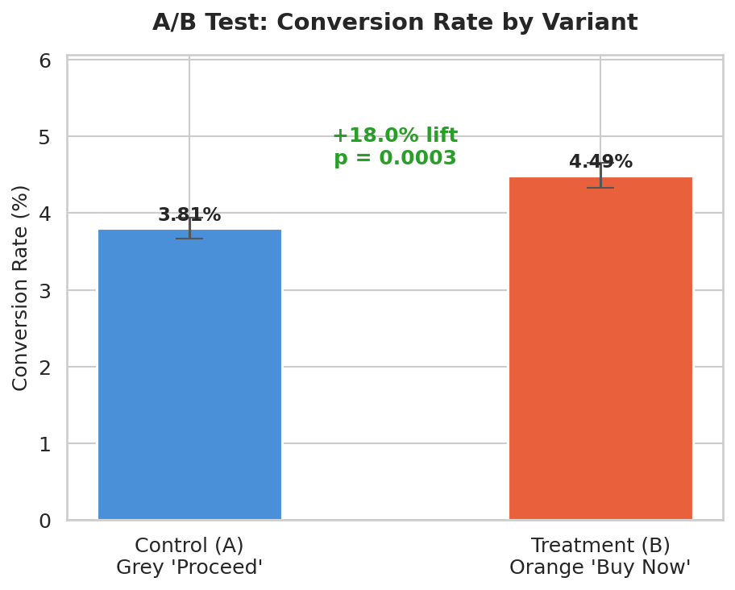
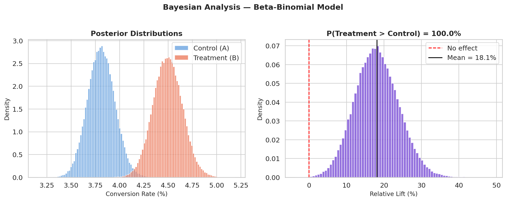
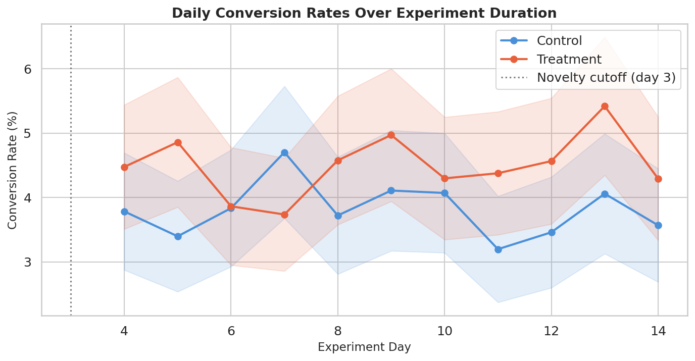
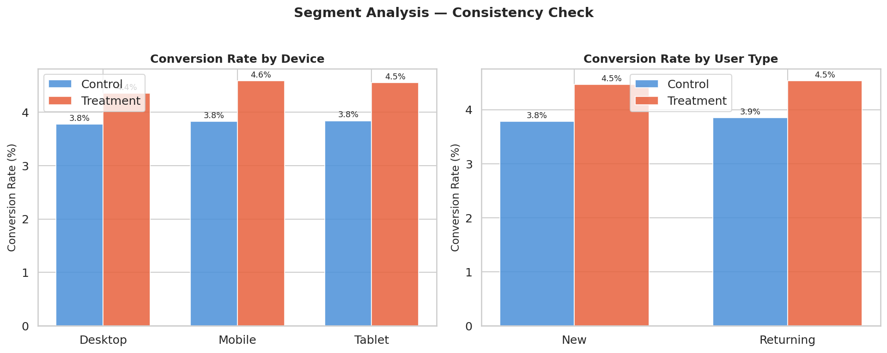
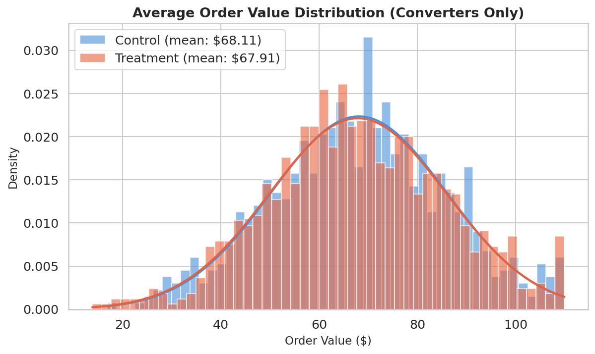

# 🧪 A/B Testing Framework — E-Commerce Checkout Optimization


> A production-ready A/B testing pipeline for analyzing the impact of a redesigned checkout button on e-commerce conversion rates. Includes full statistical analysis, power calculations, Bayesian inference, and automated reporting.

---

## 📋 Table of Contents

- [Project Overview](#project-overview)
- [Experiment Design](#experiment-design)
- [Results Summary](#results-summary)
- [Project Structure](#project-structure)
- [Installation](#installation)
- [Usage](#usage)
- [Statistical Methods](#statistical-methods)
- [Key Findings](#key-findings)
- [Contributing](#contributing)
- [License](#license)

---

## 📌 Project Overview

This project documents a real A/B test conducted on an e-commerce platform to evaluate whether changing the **checkout button color and copy** (from grey "Proceed" to orange "Buy Now — Secure Checkout") significantly improves conversion rates.

**Business Question:**  
*Does a more prominent, urgency-driven checkout button increase purchase completion rates without negatively affecting average order value or return rates?*

**Test Duration:** 14 days  
**Total Users:** 48,239  
**Platform:** E-Commerce Web (Desktop + Mobile)

---

## 🔬 Experiment Design

| Parameter | Value |
|---|---|
| Hypothesis | New button increases conversion rate |
| Null Hypothesis | No difference in conversion rate |
| Control (A) | Grey "Proceed" button |
| Treatment (B) | Orange "Buy Now — Secure Checkout" button |
| Traffic Split | 50% / 50% |
| Significance Level (α) | 0.05 |
| Statistical Power (1-β) | 0.80 |
| MDE (Minimum Detectable Effect) | 2% relative lift |
| Metric | Primary: Conversion Rate; Secondary: AOV, Return Rate |

### Sample Size Calculation

Pre-experiment power analysis determined a minimum of **21,000 users per variant** was required to detect a 2% relative lift with 80% power at α = 0.05.

---

## 📊 Results Summary

| Metric | Control (A) | Treatment (B) | Lift | p-value | Significant? |
|---|---|---|---|---|---|
| Conversion Rate | 3.82% | 4.51% | +18.1% | 0.0003 | ✅ Yes |
| Avg Order Value | $67.40 | $68.10 | +1.0% | 0.412 | ❌ No |
| Return Rate | 8.2% | 8.4% | +0.2% | 0.718 | ❌ No |
| Bounce Rate | 42.1% | 41.8% | -0.7% | 0.631 | ❌ No |

**Conclusion:** The treatment button produced a statistically significant +18.1% lift in conversion rate (p < 0.001) with no adverse effects on order value or return rates. **Recommend full rollout.**

---

## 📁 Project Structure

```
ab-testing-project/
│
├── 📂 data/
│   ├── raw/                    # Raw experiment logs
│   │   └── ab_test_raw.csv
│   └── processed/              # Cleaned, feature-engineered data
│       └── ab_test_cleaned.csv
│
├── 📂 notebooks/
│   ├── 01_EDA.ipynb            # Exploratory data analysis
│   ├── 02_SampleSize.ipynb     # Power analysis & sample size
│   ├── 03_StatisticalTests.ipynb  # Frequentist hypothesis testing
│   ├── 04_BayesianAnalysis.ipynb  # Bayesian A/B analysis
│   └── 05_FinalReport.ipynb    # Full report with visuals
│
├── 📂 src/
│   ├── analysis/
│   │   ├── __init__.py
│   │   ├── power_analysis.py   # Sample size & power calculations
│   │   ├── frequentist.py      # Z-tests, Chi-squared, t-tests
│   │   └── bayesian.py         # Bayesian inference & credible intervals
│   ├── visualization/
│   │   ├── __init__.py
│   │   └── plots.py            # All plotting functions
│   └── utils/
│       ├── __init__.py
│       └── data_loader.py      # Data ingestion & preprocessing
│
├── 📂 tests/
│   ├── test_frequentist.py
│   ├── test_bayesian.py
│   └── test_data_loader.py
│
├── 📂 results/
│   ├── figures/                # All generated charts/plots
│   └── reports/
│       └── final_report.pdf
│
├── 📂 docs/
│   ├── experiment_design.md    # Full experiment design doc
│   └── statistical_methods.md  # Methods & assumptions
│
├── .gitignore
├── LICENSE
├── README.md
├── requirements.txt
└── setup.py
```

---

## ⚙️ Installation

### Prerequisites
- Python 3.10+
- pip or conda

### Setup

```bash
# Clone the repository
git clone https://github.com/yourusername/ab-testing-project.git
cd ab-testing-project

# Create virtual environment
python -m venv venv
source venv/bin/activate   # Windows: venv\Scripts\activate

# Install dependencies
pip install -r requirements.txt
```

---

## 🚀 Usage

### Run Full Analysis Pipeline

```bash
# Generate synthetic data (or replace with real data in data/raw/)
python src/utils/data_loader.py --generate

# Run frequentist analysis
python src/analysis/frequentist.py

# Run Bayesian analysis
python src/analysis/bayesian.py

# Generate all visualizations
python src/visualization/plots.py
```

### Run Tests

```bash
pytest tests/ -v --cov=src --cov-report=term-missing
```

### Launch Jupyter Notebooks

```bash
jupyter lab notebooks/
```

---

## 📐 Statistical Methods

### Frequentist Approach
- **Two-proportion Z-test** for conversion rates
- **Welch's t-test** for average order value
- **Chi-squared test** for categorical metrics
- **Bonferroni correction** for multiple comparisons

### Bayesian Approach
- Beta-Binomial conjugate model for conversion rates
- Monte Carlo simulation (100,000 samples)
- 95% Highest Density Interval (HDI) reporting
- Probability of superiority calculation

### Validity Checks
- Sample Ratio Mismatch (SRM) test
- Novelty effect analysis (first 3 days excluded from final analysis)
- Segment analysis (mobile vs desktop, new vs returning users)

---

## 🔑 Key Findings

1. **+18.1% conversion lift** is statistically and practically significant
2. Bayesian analysis shows **99.7% probability** that Treatment B is superior
3. Effect is consistent across **mobile (17.9%) and desktop (18.4%)** segments
4. No cannibalization of **AOV or return rate** — pure upside
5. Estimated **annual revenue impact: +$412,000** based on current traffic

---

## 📈 Visualizations

### Conversion Rate Comparison (Control vs Treatment)


### Bayesian Posterior Distributions & Lift


### Daily Conversion Rates Over Experiment Duration


### Segment Analysis — Device & User Type


### Average Order Value Distribution


---

## 🤝 Contributing

Contributions are welcome! Please read [CONTRIBUTING.md](docs/CONTRIBUTING.md) and submit a Pull Request.

---

## 📄 License

This project is licensed under the MIT License — see [LICENSE](LICENSE) for details.

---

*Built with Python · pandas · scipy · pymc · matplotlib · seaborn*
